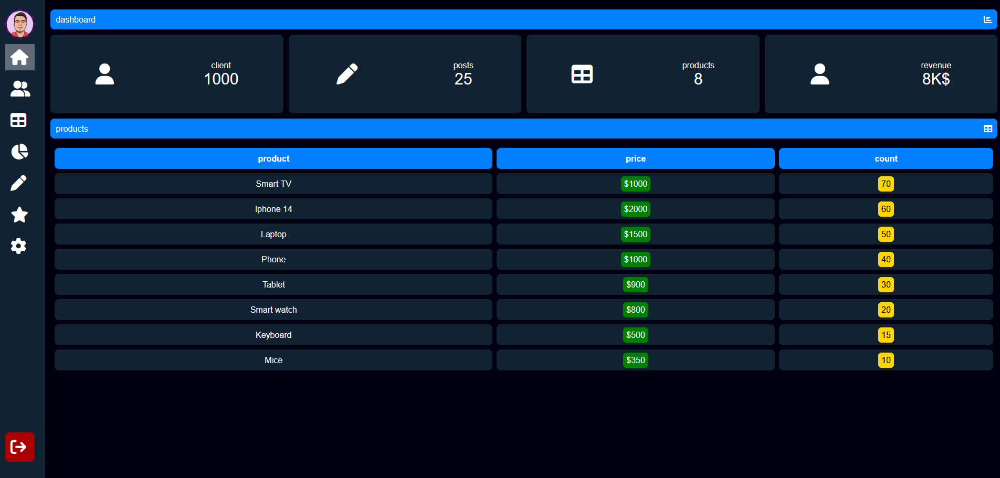
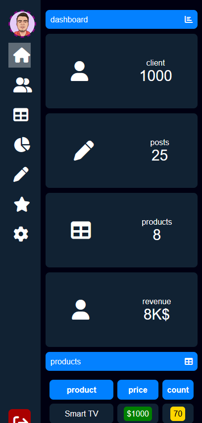

# Simple Dashboard UI

This is a minimalistic dashboard UI built using **HTML, CSS, and JavaScript**. It provides a clean and responsive interface suitable for various applications.

## 🚀 Features

- **Responsive Layout** – Works on all screen sizes.
- **Sidebar Navigation** – Simple and intuitive menu.
- **Minimal Design** – Clean and user-friendly UI.
- **Customizable Components** – Easily adaptable for different use cases.

## 🛠️ Tech Stack

- **HTML** – Structure and content
- **CSS** – Styling and layout
- **JavaScript** – Interactive elements

## 📸 Screenshots

- 
- 

## 📂 Project Setup

1. Clone the repository:
   ```bash
   git clone https://github.com/yourusername/simple-dashboard.git
   ```
2. Navigate to the project directory:
   ```bash
   cd simple-dashboard
   ```
3. Open the `index.html` file in your browser.

## 📬 Contact

For any inquiries or improvements, feel free to reach out at [ahmedmlotfi@outlook.com/contact info].

---

Made with ❤️ by Ahmed Lotfi
